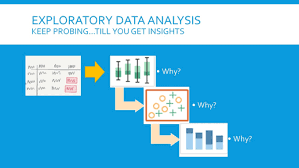

# MachineLearningUsingPython

Machine Learning is a latest **buzzword** floating around. It desrves to, as it is one of the most interesting subfield of Computer Science.

**What does Machine Learning really means?**
Machine Learning is an application of artificial intelligence(AI) that provides systems the ability to automatically learn and improve from experience without being explicitly programmed.

**Machine Learning focuses on the development of computer programs** that can access data and use it to learn for themsleves.

The process of learning begins with data, such as, direct experience, or instruction, in order to look for patterns in data and make better decisions in the future based on the examples that we provide. **The primary aim is to allow the computers learn automatically** without human intervention or assistance and adjust actions accordingly. 

# Repository Overview
This repository is about different Machine Learning algorithm approaches as per the industry practices.

# Table of Contents
- Exploratory Data Analysis
- Spam Detection Unsing Various ML Algorithms
- Gender Voice Recognition
- Bank Loan Processing
- Car Price prediction
- House Price Prediction using Various ML Algorithms
- Candy Type Prediction
- Avocado Type Prediction
- Credit Card User Segmentation
- Credit Card Fraud detection using various ML Algorithms
- HR Attrition Analysis

------------

| Exploratory Data Analysis  |   |
